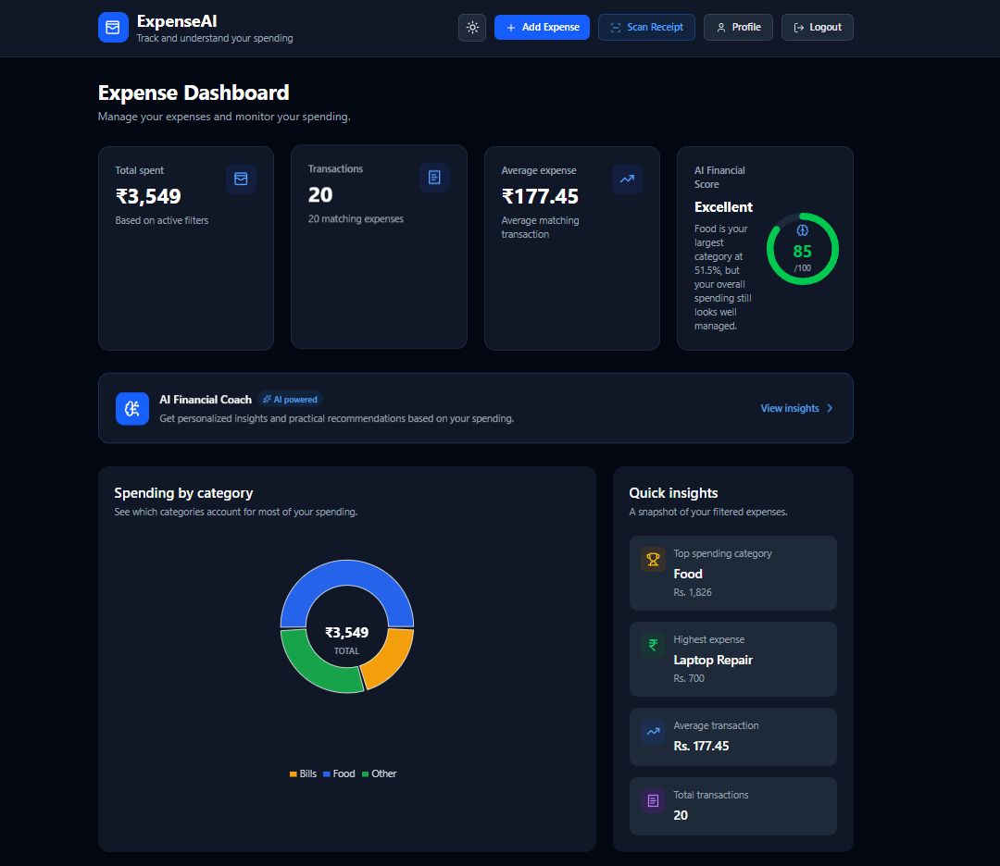
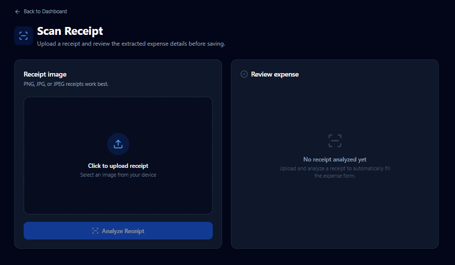

# ExpenseAI

ExpenseAI is a full-stack personal expense management application built with **Spring Boot** and **React**.

It allows users to securely manage expenses, analyze spending, scan receipts using OCR, verify accounts through email OTP, and receive AI-powered financial insights.

---

## Live Demo

Frontend:  
https://ai-expense-tracker-plum.vercel.app

Backend:  
https://ai-expense-tracker-bcfa.onrender.com

Swagger:  
https://ai-expense-tracker-bcfa.onrender.com/swagger-ui/index.html

> The backend is hosted on Render's free tier, so the first request after inactivity may take some time.

---

## Screenshots

### Dashboard


### Receipt Scanner


### AI Financial Coach


---

## Features

- User registration and login
- Email verification using OTP
- JWT authentication
- BCrypt password hashing
- Expense CRUD operations
- Expense categories
- Spending analytics and charts
- User profile and password change
- Receipt scanning using Tesseract OCR
- AI-powered financial insights using Gemini
- PDF and Excel export
- Responsive UI
- Swagger API documentation

---

## Tech Stack

### Backend
- Java 17
- Spring Boot
- Spring Security
- Spring Data JPA
- Hibernate
- PostgreSQL
- JWT
- BCrypt
- Maven

### Frontend
- React
- Vite
- Tailwind CSS
- Axios
- Recharts

### Services
- Gemini API
- Tesseract OCR
- Brevo Email API
- Neon PostgreSQL

### Deployment
- Vercel — Frontend
- Render — Backend
- Neon — Database
- Docker — Backend containerization

---

## Architecture

```text
User
  │
  ▼
React Frontend
  │
  ▼
Spring Boot REST API
  │
  ├── PostgreSQL
  ├── Gemini API
  ├── Brevo Email API
  └── Tesseract OCR
```

---

## AI Financial Coach

Financial calculations are performed in Java before data is sent to Gemini.

```text
PostgreSQL
    ↓
FinancialSummaryService
    ↓
Total spending / averages / categories
    ↓
Gemini API
    ↓
Insights and recommendations
```

This keeps numerical calculations deterministic while using AI only for interpretation.

---

## Receipt OCR

```text
Receipt Image
    ↓
React Upload
    ↓
Spring Boot
    ↓
Tesseract OCR
    ↓
Merchant / Amount / Date / Category
    ↓
Editable Preview
    ↓
Save Expense
```

---

## REST API

### Authentication

| Method | Endpoint | Description |
|---|---|---|
| POST | `/api/auth/register` | Register user and send OTP |
| POST | `/api/auth/login` | Login and receive JWT |
| POST | `/api/auth/verify-email` | Verify email |
| POST | `/api/auth/resend-otp` | Resend OTP |

### Expenses

| Method | Endpoint | Description |
|---|---|---|
| GET | `/api/expenses` | Get expenses |
| POST | `/api/expenses` | Add expense |
| PUT | `/api/expenses/{id}` | Update expense |
| DELETE | `/api/expenses/{id}` | Delete expense |

### User

| Method | Endpoint | Description |
|---|---|---|
| GET | `/api/users/me` | Get profile |
| PUT | `/api/users/me/password` | Change password |

### AI & OCR

| Method | Endpoint | Description |
|---|---|---|
| GET | `/api/ai/summary` | Generate financial summary |
| POST | `/api/ai/coach` | Generate AI insights |
| POST | `/api/receipts/upload` | Scan receipt |

---

## Running Locally

### Backend

```bash
cd backend
mvn spring-boot:run
```

Runs on:

```text
http://localhost:8080
```

### Frontend

```bash
cd frontend
npm install
npm run dev
```

Runs on:

```text
http://localhost:5173
```

---

## Environment Variables

### Backend

```env
DB_URL=
DB_USERNAME=
DB_PASSWORD=

JWT_SECRET=
JWT_EXPIRATION=

BREVO_API_KEY=
MAIL_FROM=

GEMINI_API_KEY=
GEMINI_MODEL=
```

### Frontend

```env
VITE_API_BASE_URL=
```

Never commit real API keys or passwords.

---

## Project Structure

```text
ai-expense-tracker/
├── backend/
├── frontend/
├── docs/
│   └── screenshots/
├── .gitignore
└── README.md
```

---

## Future Improvements

- Automated backend tests
- Frontend tests
- Refresh tokens
- Rate limiting
- Budget limits
- Recurring expenses
- Improved OCR accuracy

---

## Author

**Mohit Ranjan**

Built as a full-stack portfolio project using Java, Spring Boot, React, PostgreSQL, Docker, OCR, and Generative AI.